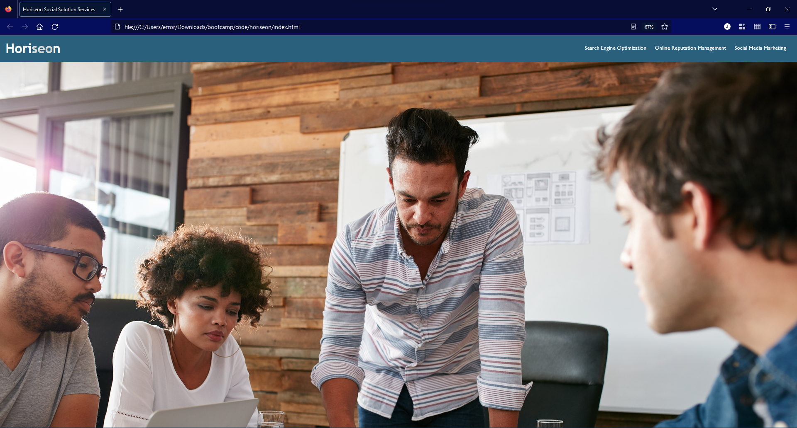

# Horiseon

## Description

I used this project to assess my current html and css skills. It uses semantic tags, and responsive css.


## Table of Contents (Optional)

- [Installation](#installation)
- [Usage](#usage)
- [License](#license)

## Installation

To install:
```
git pull git@github.com:error201/horiseon.git
```

## Usage

Click the links and watch the magic happen.




## License

This project is covered under the GNU general public license. See attached.

---

## Badges


## How to Contribute

Feel free to fork this repository!
